# Live SOC Analyst Project

## Objective
This project showcases a real-world SOC (Security Operations Center) investigation, covering alert monitoring, log analysis, and incident escalation. The analysis is conducted using a SIEM tool and Splunk to detect and respond to security incidents.

---

## Steps

### **Step 1: Initial SIEM Overview**  
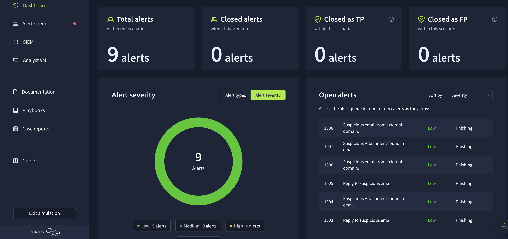  
*Viewing the SIEM dashboard; alerts have not fully loaded, only low-severity alerts are visible.*  

### **Step 2: Alert Queue - No Critical Findings Yet**  
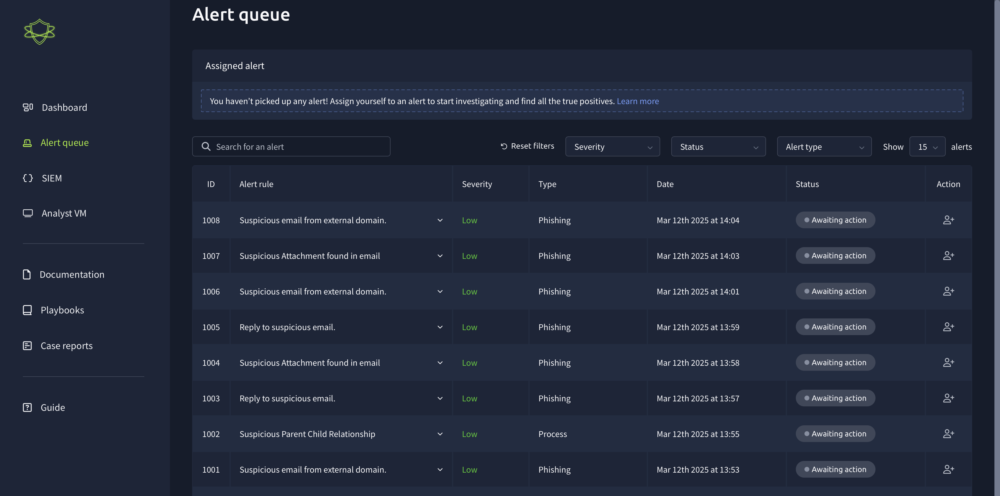  
*Accessing the alert queue, but critical alerts have not fully loaded yet.*  

### **Step 3: Reviewing Low-Severity Alerts**  
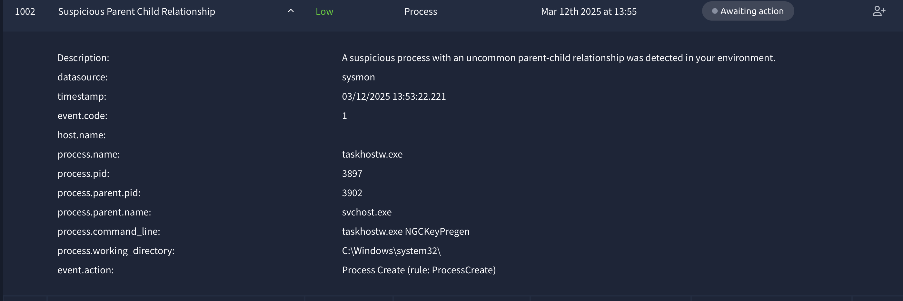  
*Examining a low-severity alert, but no immediate security concerns are found.*  

### **Step 4: Opening Splunk for Investigation**  
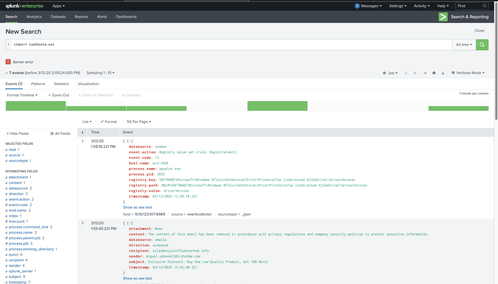  
*Launching Splunk to analyze logs and gather more details on potential threats.*  

### **Step 5: High-Severity Alerts Detected**  
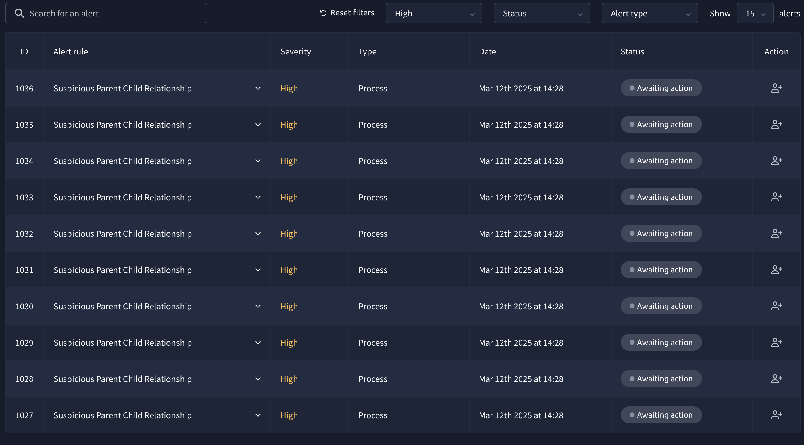  
*High-severity alerts appear in the SIEM, showing multiple suspicious parent-child process relationships from the same account and device.*  

### **Step 6-7: Investigating High-Severity Alerts**  
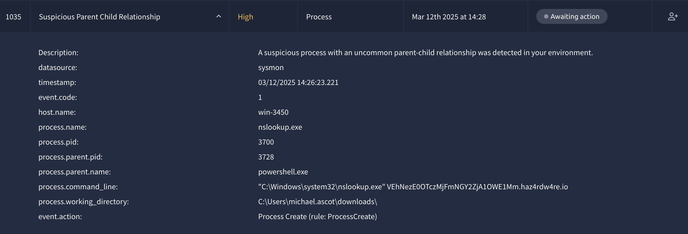  
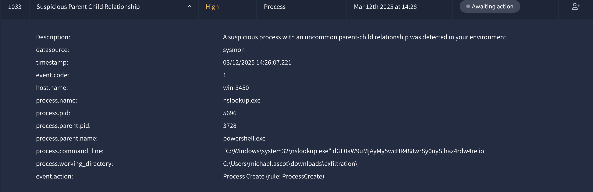  
*Examining the details of the alerts:*  
- **User:** michael.ascott  
- **Process:** nslookup.exe launched by powershell.exe  
- **Working Directory:** C:\Users\michael.ascot\downloads\  
- **Possible C2 (Command & Control) server communication detected**  

### **Step 8-12: Log Analysis in Splunk**  
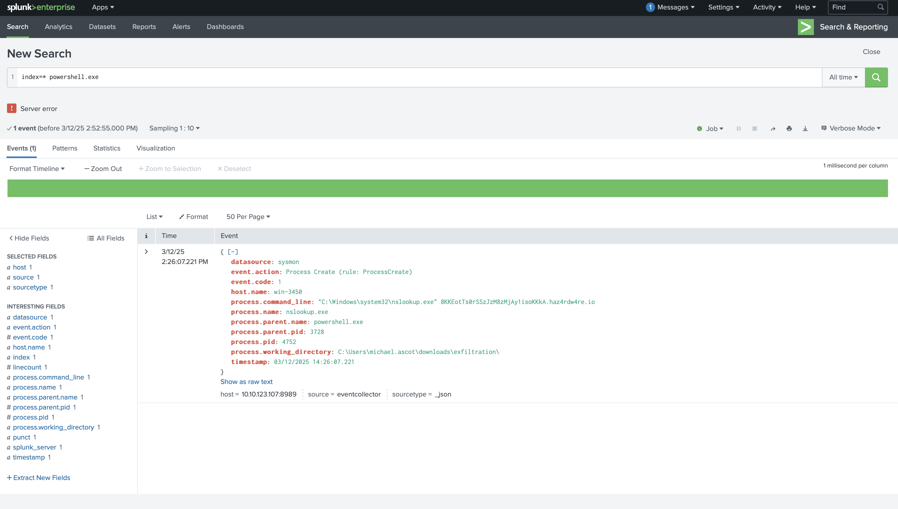  
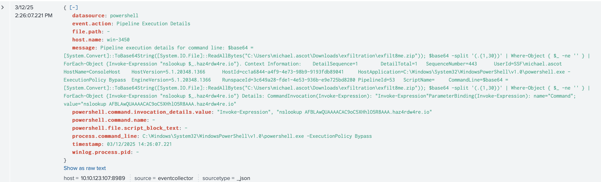  
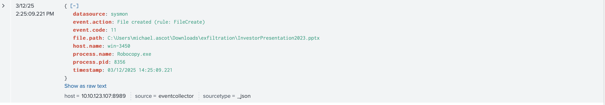  
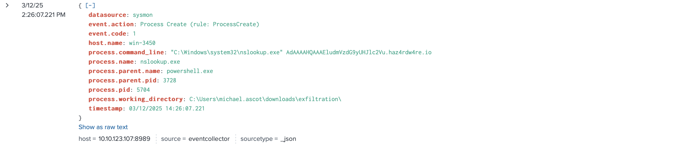  
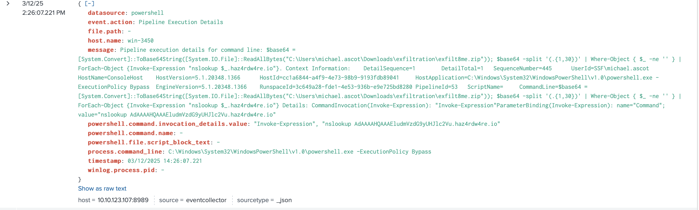  
*Using Splunk to investigate the logs further. Findings suggest script-based execution with potentially encoded communication.*  

### **Step 13: SIEM Dashboard with Fully Loaded Alerts**  
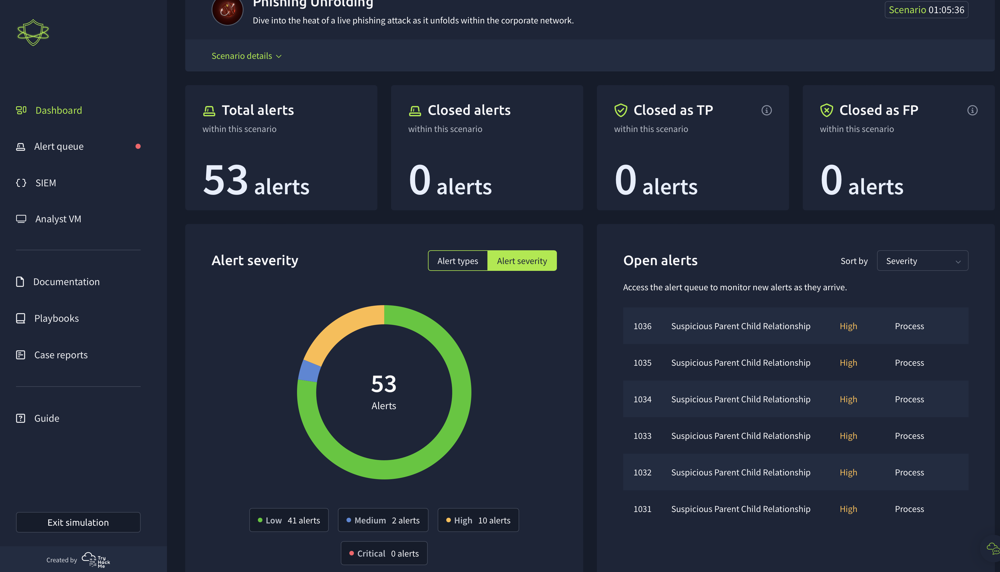  
*The SIEM dashboard now displays all alerts, confirming multiple related incidents.*  

### **Step 14: Reviewing the Alert Queue Again**  
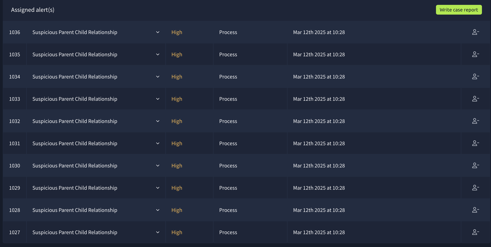  
*Verifying alert patterns before taking action.*  

### **Step 15-16: Confirming True Positive & Assigning Alerts**  
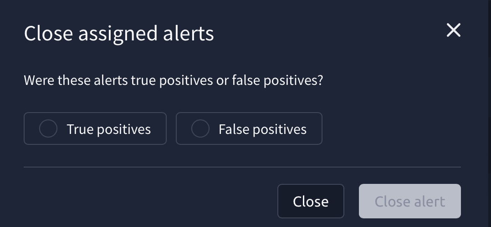  
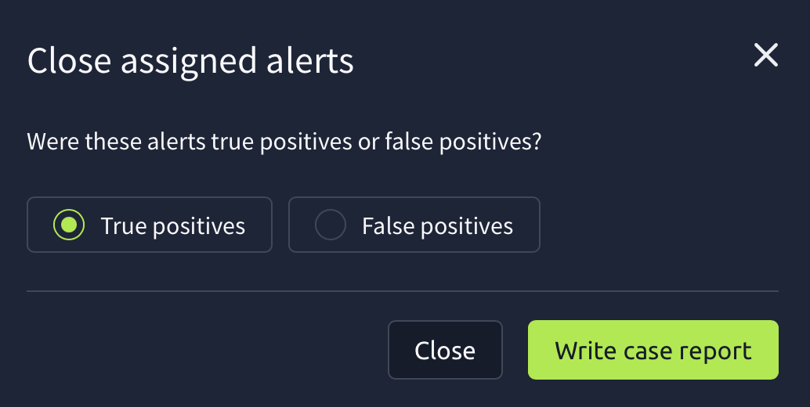  
*After investigation, alerts are confirmed as True Positive (TP) and assigned for escalation.*  

### **Step 17-19: Incident Report & Findings**  
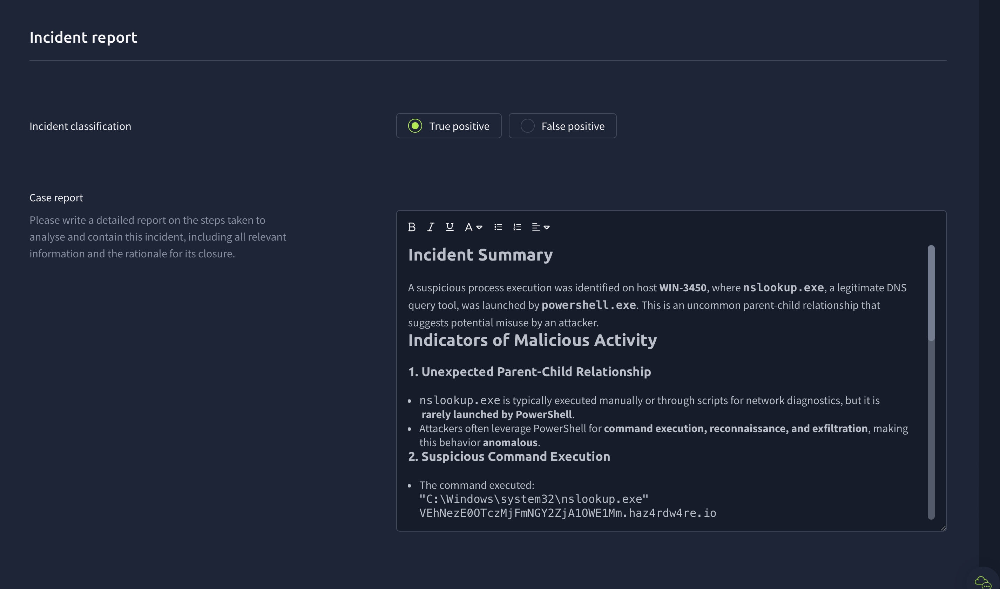  
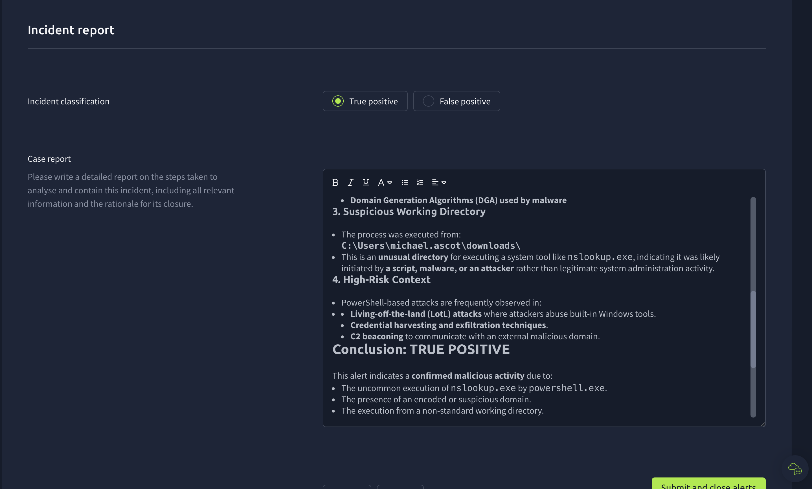  
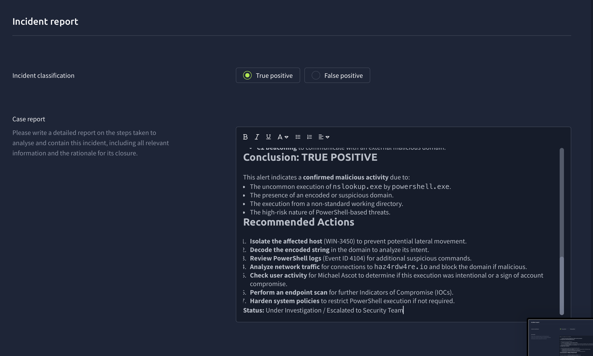  
*Documenting the findings and justifying why the incident is a confirmed security threat.*  

### **Step 20: Closing & Escalating the Incident**  
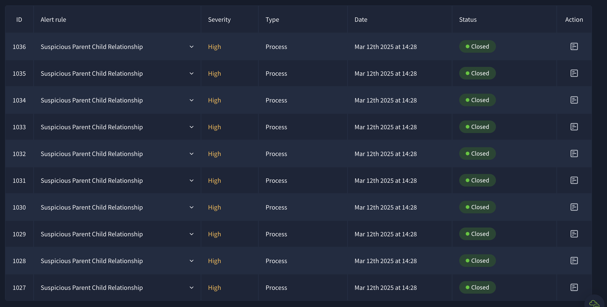  
*The security event is escalated to a superior for further review and action.*  

### **Step 21: Identifying the Root Cause**  
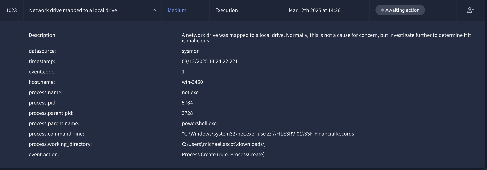  
*Analysis suggests that a network drive mapped to a local drive could be the source of the problem, potentially exposing the system to unauthorized access or malware execution.*  

---

## **Conclusion**  
This investigation confirmed a true positive security incident, demonstrating:  
✔️ SOC workflows for incident detection & analysis  
✔️ Log analysis using Splunk  
✔️ Detecting malicious process chains & C2 beaconing  
✔️ Proper escalation procedures  

This project highlights essential cybersecurity skills, such as threat hunting, incident response, and SIEM analysis, making it a valuable hands-on experience in security operations.
